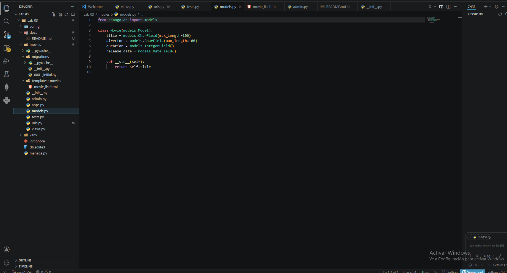
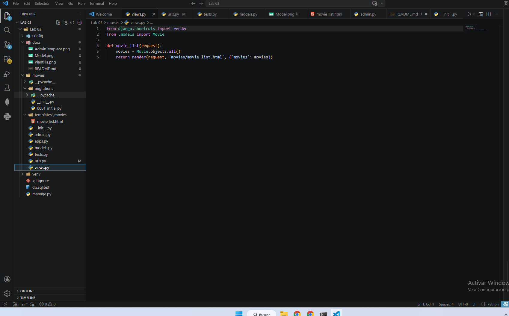
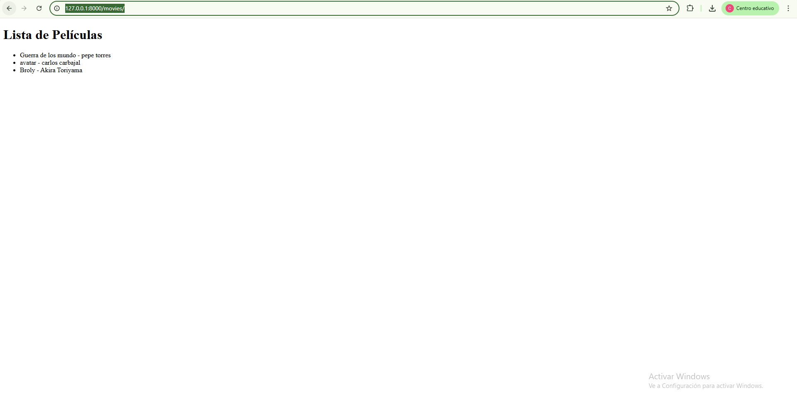
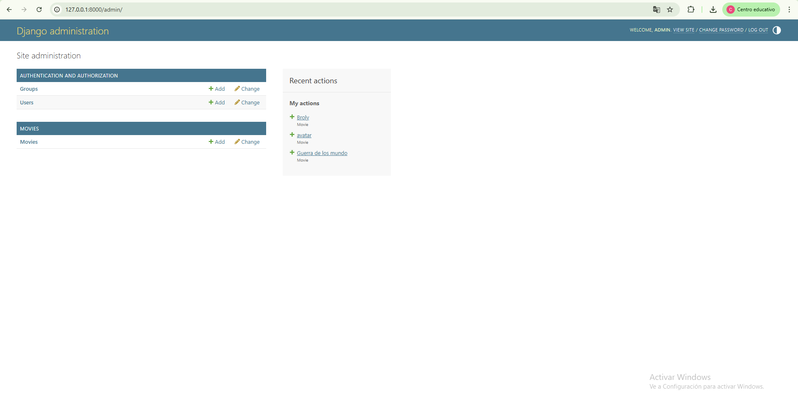

# 🎬 Cinespoilers - Lab 03

Proyecto desarrollado con Django.

---

## 🚀 Funcionalidades
- CRUD de películas en el panel de administración
- Listado de películas en el frontend usando templates

---

## 📸 Evidencias

### 🧩 Modelo (models.py)

---

### 🧠 Vista (views.py)

---

### 🌐 Template (HTML)

---

### 🖼️ Plantilla (Frontend)

---

### 🔐 Panel Admin

---

## ⚙️ Tecnologías usadas
- Python
- Django 6
- SQLite